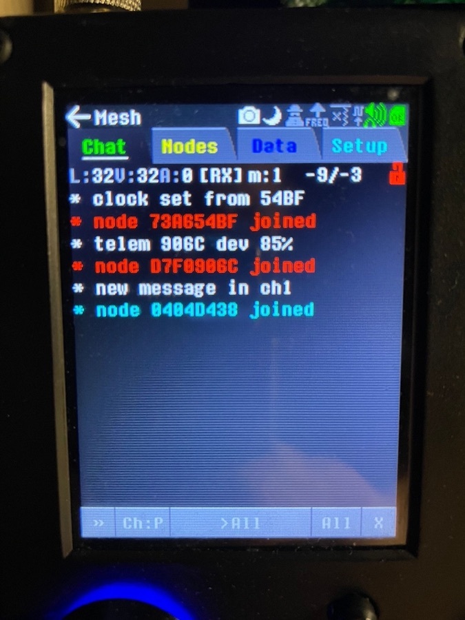
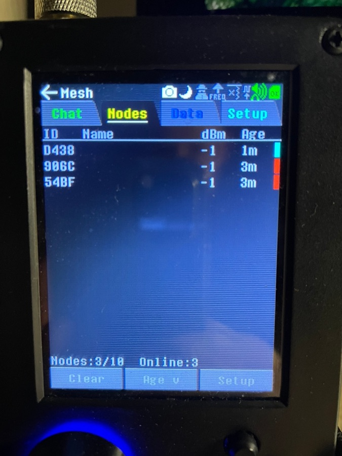

# Meshtastic on the HackRF PortaPack (Mayhem) — with 256-bit channel keys

A ready-to-flash build of the **Mayhem** firmware that includes the **Mesh** app from
[pull request #3306](https://github.com/portapack-mayhem/mayhem-firmware/pull/3306) by verhogladov, plus one patch of
ours that lets it read channels protected by a **32-byte (AES-256) key**, which is what many real Meshtastic setups use.

Mesh turns the PortaPack into a Meshtastic node **without a LoRa chip**: the LoRa modem runs in software on the HackRF's
M4. It talks to stock nodes (chat, encrypted channels, node list, telemetry, positions, map, traceroute).

> **Status:** works on one setup: HackRF One R10 + PortaPack **H2**, **EU 433 MHz**, **LongFast**, against a Heltec V3 and a
> Wireless Paper on a private mesh with custom channels. Received frames, decoded nodes, telemetry, node names and the
> clock sync from peers. Reading message *text* in the custom channels and transmitting were not verified here (the app
> was run receive-only). The Mesh PR itself is not merged upstream; this is an unofficial build of unmerged code.

<p>
  
  &nbsp;&nbsp;
  
</p>

## What is in the box

| | |
|---|---|
| `FIRMWARE/portapack-mayhem_mesh-aes256.bin` | the firmware (Mayhem built from the PR branch + our patch) |
| `APPS/` | all external apps, built from the same tree |
| `BASEBAND/` | baseband images that the PR moved from flash to the SD card |
| `patches/0001-…` | our change on top of PR #3306 (see [docs/FINDINGS.md](docs/FINDINGS.md)) |
| `tools/mesh_channels_to_ini.py` | copies your node's channels (names + keys) into the app's settings |

## Install

All three folders must come from the **same build**: apps with a different version hash are not listed, and without
`BASEBAND` some apps report `NoImg`.

1. Back up your SD card (`FIRMWARE`, `APPS`, `BASEBAND`, `SETTINGS`).
2. Download the release zip, unpack it into the **root of the SD card** (merge with the existing folders).
3. On the device: **Utilities → Flash Utility**, choose `portapack-mayhem_mesh-aes256.bin`.
4. **Open Mesh first after boot** (the app needs a contiguous block of memory; later it can fail with "out of memory").
5. **Settings → Radio:** Region (e.g. `EU 433 MHz`) and Preset (`LONG_FAST`) must match your nodes; leave Freq on
   `Auto (Region)`. Connect an antenna for your band (the app shows the quarter-wave length).
6. To only listen, tap the `RX` lock in the Chat status row (or `radiomode=2` in the ini): nothing is ever sent.

To go back, flash an official `.bin` the same way and restore your `APPS` backup.

## Reading your own encrypted channels

If the Chat console shows `* hash XX!=YY` the radio works but the packets belong to a channel the app does not know. Add
the channel (name + key):

```bash
pip install meshtastic
python3 tools/mesh_channels_to_ini.py --port /dev/cu.usbserial-0001 \
        --ini /Volumes/<SD>/SETTINGS/meshtastic.ini            # add --dry-run to just list
```

(or write `c1_name=…`, `c1_key=<64 hex>`, `c1_en=1` by hand; up to 10 channels). The keys are stored **in plain text on the
SD card**: keep the card private. 64-hex (AES-256) keys need this build; stock PR #3306 only accepts 32 hex digits.

In Chat, tap `Ch:` to pick the channel to read.

## Limits

- Node list holds **10** nodes (memory); older ones are evicted. `log=1` in the ini writes every received frame to
  `/LOGS/mesh_rx.csv`.
- Eleven other apps' baseband images live on the SD card now; weather and the SubGHz decoder may not load.
- Transmit with a HackRF is your responsibility: check the rules of your band (for EU 433: about 10 mW ERP and a duty
  cycle limit). The app has a region power limit; use the `RX` lock if you only want to listen.

More background: [docs/FINDINGS.md](docs/FINDINGS.md).

## Build it yourself

```bash
scripts/build.sh      # needs Docker; fetches the PR branch at the tested commit, applies patches/, builds
```

Output: `dist/mesh-pr3306-aes256/{FIRMWARE,APPS,BASEBAND}`. Base: Mayhem PR #3306 at `51135ec` (2026-09-10).

## Credits and license

- The Mesh app and the LoRa modem: **verhogladov** ([PR #3306](https://github.com/portapack-mayhem/mayhem-firmware/pull/3306)).
  If you can, test it and leave feedback there.
- Firmware: [Mayhem](https://github.com/portapack-mayhem/mayhem-firmware) (GPL).
- This repository: GPL-2.0-or-later ([LICENSE](LICENSE), [NOTICE](NOTICE)). Unofficial; not affiliated with Mayhem,
  Meshtastic or the PR author. Flash custom firmware at your own risk.
